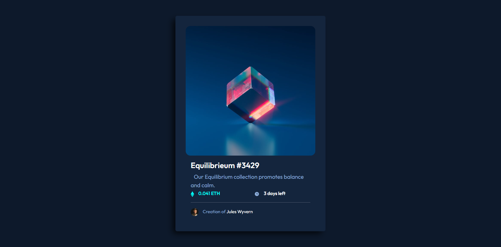
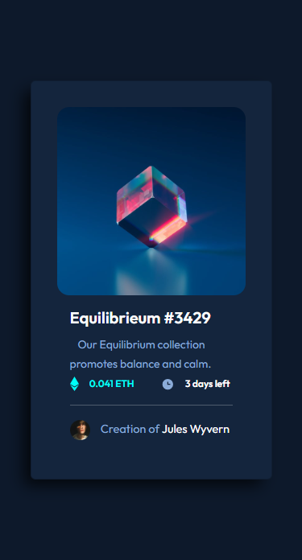

# Frontend Mentor - NFT preview card component solution

This is a solution to the [NFT preview card component challenge on Frontend Mentor](https://www.frontendmentor.io/challenges/nft-preview-card-component-SbdUL_w0U). Frontend Mentor challenges help you improve your coding skills by building realistic projects.

## Table of contents

- [Overview](#overview)
  - [The challenge](#the-challenge)
  - [Screenshot](#screenshot)
  - [Links](#links)
- [My process](#my-process)
  - [Built with](#built-with)
  - [Continued development](#continued-development)
- [Author](#author)

## Overview

### The challenge

Users should be able to:

- View the optimal layout depending on their device's screen size
- See hover states for interactive elements

### Screenshot

Desktop version

Mobile version

### Links

- Solution URL: [Code on GitHub](https://github.com/hatemhenchir/NFT-preview-card-component/)
- Live Site URL: [GitHub Pages Live URL](https://hatemhenchir.github.io/NFT-preview-card-component/)

## My process

### Built with

- Semantic HTML5 markup
- CSS custom properties
- Flexbox
- Bootstrap 5

### Continued development

Will do more of these challenges to improve my skills.

## Author

- Frontend Mentor - [@hatemhenchir](https://www.frontendmentor.io/profile/hatemhenchir)
- Linkedin - [@hatem-henchir-7a92141a8](https://www.linkedin.com/in/hatem-henchir-7a92141a8/)
